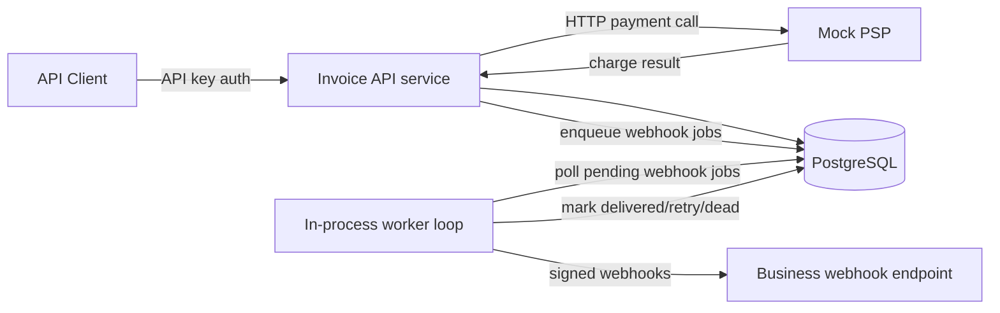
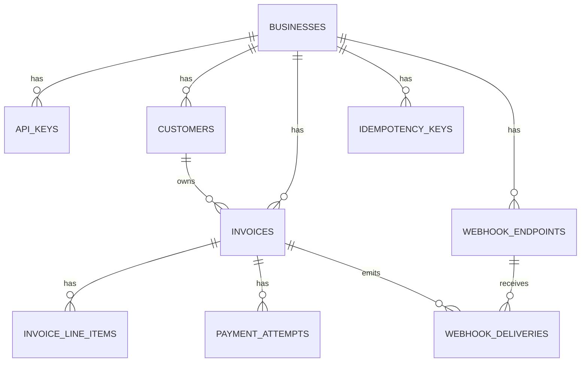
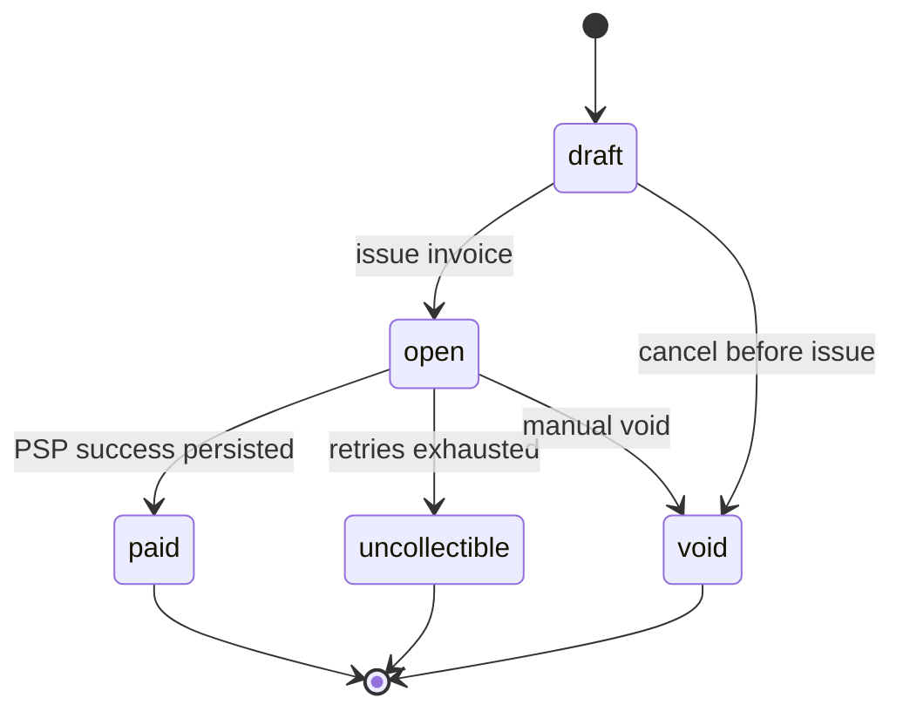
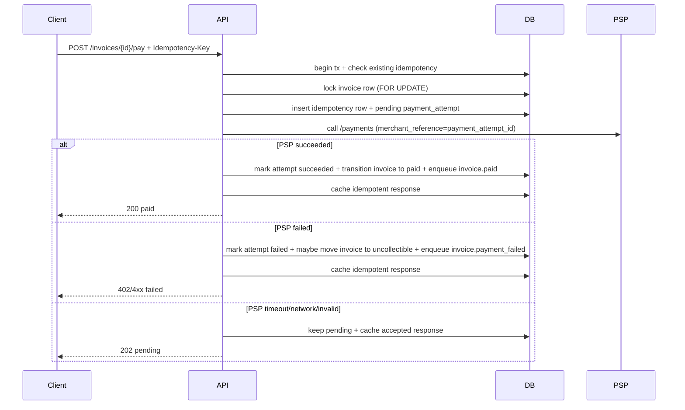

# DESIGN

This document explains the design that is currently implemented in code for this take-home.

The two hardest problems in this assignment are (1) making sure two concurrent pay requests cannot both succeed on the same invoice, and (2) minimising the inconsistency window when a PSP call succeeds but the process crashes before writing to the DB. Every design choice here traces back to one of those two problems.

I used Postgres row locks instead of application-level coordination because the database is the only place where both requests actually meet. I used a single finalization transaction (lock → idempotency check → PSP call → write) instead of splitting it into steps because a split flow creates a window where both requests pass the read before either completes the write.

For (2), the implementation uses idempotency keys to prevent the PSP being called twice for the same logical request — if the client retries with the same idempotency key, the cached `202 pending` response is returned immediately. The `merchant_reference = payment_attempt_id` serves as a correlation ID only (each attempt gets a fresh UUID). The known gap is that if the process crashes after PSP succeeds but before the DB write, the worker marks the stale attempt `failed` — the system says failed, the card was charged.

## System Overview`

Current deployment from docker compose:
- postgres
- mock-psp
- invoice-api

The worker is not a separate container right now. It runs as an async task inside invoice-api, in parallel with the HTTP server.

## 1. Data Model

### 1.1 ER Diagram

### 1.2 Table-by-table (shape, indexes, PK, reason, 100x note)

1. businesses
- PK: UUID (`id`).
- Shape: tenant root (`id`, `name`, `created_at`).
- Indexes: PK only.
- Why this shape: all other data hangs off business scope.
- 100x: shard by `business_id` hash across Postgres instances; add `plan` column for per-tenant rate limits.

2. api_keys
- PK: UUID.
- Shape: `business_id`, `key_prefix`, `key_hash`, `revoked_at`, timestamps.
- Indexes: unique on `key_prefix`, index on `(business_id, revoked_at)`.
- Why this shape: fast lookup by prefix and safe storage (no plaintext at rest).
- 100x: cache key validation in Redis (TTL ~60s) so auth never hits the DB primary on steady-state traffic.

3. customers
- PK: UUID.
- Shape: `business_id`, `name`, `email`, `created_at`.
- Indexes: `(business_id, created_at desc)`, unique `(business_id, email)`.
- Why this shape: customer emails are unique per business, not global.
- 100x: replace OFFSET pagination with keyset cursor on `(created_at, id)` — OFFSET scans grow linearly with page depth.

4. invoices
- PK: UUID.
- Shape: `business_id`, `customer_id`, `state`, `due_date`, `total_amount_cents`, `currency`, timestamps.
- Indexes: `(business_id, state, created_at desc)`, `(customer_id, created_at desc)`.
- Why this shape: list-by-state and list-by-customer are core reads.
- 100x: partition by `created_at` month; use pgBouncer in transaction mode to prevent connection exhaustion under burst pay traffic.

5. invoice_line_items
- PK: UUID.
- Shape: `invoice_id`, `description`, `quantity`, `unit_amount_cents`, `line_total_cents`, `created_at`.
- Indexes: `(invoice_id)`.
- Why this shape: server computes totals and stores immutable line values.
- 100x: archive rows older than 90 days to cold storage (S3 JSON); keep only `total_amount_cents` on the hot invoice row.

6. idempotency_keys
- PK: UUID.
- Shape: `business_id`, `key`, `request_fingerprint`, `response_status`, `response_body`, timestamps.
- Indexes: unique `(business_id, key)`, index `(expires_at)`.
- Why this shape: safe replay and exact response caching.
- 100x: move to Redis with TTL — eliminates the DB write per payment request and the periodic expiry cleanup job.

7. payment_attempts
- PK: UUID.
- Shape: `invoice_id`, optional `idempotency_key_id`, `status`, `psp_ref`, `failure_code`, timestamps.
- Indexes: `(invoice_id, created_at desc)`, unique `psp_ref` (non-null).
- Why this shape: full trace of all tries and dedupe by PSP reference.
- 100x: partition by `created_at` month; move partitions older than 3 months to a data warehouse (BigQuery/Redshift) for reporting.

8. webhook_endpoints
- PK: UUID.
- Shape: `business_id`, `url`, `secret_hash`, `signing_secret`, `active`, `created_at`.
- Indexes: `(business_id, active)`.
- Why this shape: one business can register multiple active endpoints.
- 100x: cache active endpoints per business in Redis to avoid a DB lookup on every event enqueue.

9. webhook_deliveries
- PK: UUID.
- Shape: `endpoint_id`, `invoice_id`, `event_type`, `payload_json`, `status`, `attempt_count`, `next_attempt_at`, `last_error`, `delivered_at`, `created_at`.
- Indexes: `(status, next_attempt_at)`, `(endpoint_id, created_at desc)`, `(invoice_id)`.
- Why this shape: durable async queue with retry metadata.
- 100x: replace DB-backed queue with SQS/Kafka; `FOR UPDATE SKIP LOCKED` only scales to a handful of worker replicas before lock contention limits throughput.

## 2. Invoice State Machine

Notes about implemented behavior:
- The enum supports `draft`, `open`, `paid`, `void`, `uncollectible`.
- Current create-invoice path creates invoices in `draft`.
- When `POST /invoices/{id}/pay` is called for a `draft` invoice, the service transitions it to `open` in the same transaction before payment processing.
- Terminal states: `paid`, `void`, `uncollectible`.
- Reversible transitions: none in current implementation.
- Invalid transitions are rejected by the API/service with `409` and a clear error.
- `void` is a fully implemented state and valid transition in code (`draft→void`, `open→void`), but no HTTP endpoint exposes it in this implementation. The transition logic is guarded by `can_transition_to()` and enforced by `transition_state()`. A `POST /invoices/{id}/void` endpoint can be added without any model or schema changes.

## 3. Payment Correctness and Failure Modes

Concurrency mechanism used:
- Row-level lock using `SELECT ... FOR UPDATE` on the invoice row, inside a DB transaction.
- Idempotency key row is also locked/checked in transaction.

Why row-level lock (`SELECT ... FOR UPDATE`) over alternatives:
- Advisory lock: you'd have to manually manage a numeric lock key per invoice — FOR UPDATE just locks the row itself, automatically.
- Optimistic concurrency: if two requests race, one has to retry and re-call the PSP — too risky when a retry could mean charging the card twice.
- Serializable isolation: Postgres aborts and retries whole transactions on any conflict — FOR UPDATE blocks only the one invoice row, nothing else.
- Status-conditional UPDATE: a blind `WHERE state='draft'` update can't tell you *why* it failed (already paid? doesn't exist?) and can't do the idempotency check in the same step.

### 3.1 Pay request flow

### 3.2 Required scenarios

(a) Two clients call POST /invoices/{id}/pay at the same instant
- One request gets the row lock first.
- The other waits and then sees updated state or existing idempotency record.
- Outcome: at most one successful paid transition for 

(b) `tok_timeout` (PSP sleeps ~30s)
- Invoice API client timeout is 3 seconds.
- Endpoint returns `202` pending quickly.
- Payment attempt stays `pending`; invoice stays `open`.
- Eventual resolution: worker marks stale pending as failed after timeout threshold, and caller can also retry with same idempotency key to get consistent response.

(c) PSP returns success but service crashes before persistence
- The DB still has `payment_attempts.status = 'pending'` and invoice stays `open`.
- The worker will eventually find the stale pending attempt and mark it `failed` — it does not query the PSP to reconcile, so the system ends up saying failed even though the card was charged.
- `merchant_reference = payment_attempt_id` — each payment attempt gets a fresh UUID at insert time, so every new request sends a different `merchant_reference`. This does NOT protect against double-charging on a client retry. It only serves as a correlation ID for ops/support to trace which DB attempt corresponds to which PSP charge.
- If the client retries with the **same idempotency key**, the idempotency cache returns the stored `202 pending` response and the PSP is never called again — this is the actual double-charge protection.
- This is a known bounded inconsistency window. A full reconciliation would require querying the PSP by `merchant_reference` on restart, which this implementation does not do.

(d) Same idempotency key reused with different body
- Service compares stored request fingerprint (`method + path + token input`).
- If mismatch, return `409` conflict (`idempotency key reused with different payload`).

(e) POST /pay on an already paid invoice
- Service rejects with `409` (`invoice is not in payable state`).
- No new successful payment attempt is created.

## 4. Webhook Design

### 4.1 Event types
- `invoice.created`
- `invoice.paid`
- `invoice.payment_failed`

### 4.2 Delivery design
- API stores webhook jobs in `webhook_deliveries` in the DB transaction.
- Worker loop claims due rows with `FOR UPDATE SKIP LOCKED`.
- Worker sends HTTP POST and updates status to `delivered`, `pending` (retry), or `dead`.

### 4.3 Signing scheme and replay protection
- Algorithm: HMAC-SHA256.
- Signed string: `timestamp + "." + raw_json_body`.
- Headers sent:
  - `X-Webhook-Id`
  - `X-Webhook-Timestamp`
  - `X-Webhook-Signature`
  - `X-Webhook-Event`
- Replay protection model: receiver should validate freshness of `X-Webhook-Timestamp` and signature. The sender provides all required values.

### 4.4 Retry policy (implemented numbers)
- Max attempts: 7 total.
- Retry delays by attempt: 30s, 120s, 600s, 1800s, 3600s, 7200s.
- Total retry window: about 4 hours.
- After final failure: mark row `dead`, store `last_error`, keep row for reconciliation.

### 4.5 Reconciliation for missed events
- Query `webhook_deliveries` where `status = 'dead'`.
- Inspect payload and error.
- Replay manually or with an ops script.

Why webhook delivery is decoupled from API response path:
- Prevents slow/unavailable customer endpoints from increasing invoice/payment API latency.
- Preserves delivery intent durably, even across process restarts.

## 5. API Key Model

Generation
- Format: `dpk_<12-byte-hex-prefix>_<32-byte-hex-secret>`.
- Source: `OsRng` secure random bytes.

Storage
- Store only `key_prefix` and `key_hash` (`SHA-256(raw_key [+ optional pepper])`).
- Plaintext key is returned only when created/rotated.

Transmission
- `Authorization: Bearer <api_key>`.
- No query-string key transport.

Rotation and revocation
- Rotation revokes current active keys for the business and creates one new key in one transaction.
- Revocation sets `revoked_at`; auth middleware blocks revoked keys.

Blast radius if leaked
- A leaked key is scoped to one business.
- Prefix-based lookup makes revocation fast.
- Optional pepper adds extra safety if DB leaks.

## 6. What I Cut and Why

1. Refunds and partial payments
- Out of scope and would add accounting/state complexity.

2. Multi-currency and FX
- Assignment explicitly asks for USD only.

3. External queue (Kafka/SQS/RabbitMQ)
- Not needed for this scope; DB-backed queue is enough for correctness.

4. OAuth/JWT auth model
- Assignment asks for API key auth only.

5. Production-grade rate limiting
- Not required to build now; better documented as a next step.

6. Admin API for API key management (create/rotate/revoke via HTTP)
- The key generation, hashing, and revocation logic is fully implemented in code; a business can only use the seeded demo key right now.
- Skipped because the assignment does not require an admin surface — adding a `POST /api-keys` and `DELETE /api-keys/:id` endpoint would be straightforward with no schema changes needed.

## 7. Production Readiness Gap (Top 3)

1. No distributed tracing
- If a payment gets stuck in `pending`, you have to manually query `payment_attempts` to find out why. Need a trace ID that follows the request through the PSP call and DB write so you can debug a customer complaint in one lookup, not a log grep.

2. No rate limiting 
- A new idempotency key on every call = a new payment attempt every time. A bad actor can hammer `POST /invoices/:id/pay` and rack up PSP failures — which can attract card network scrutiny. Need a per-business rate cap specifically on that endpoint.

3. No dunning (automatic retry scheduling after failure)
- When a payment fails the invoice just sits `open`. Nothing happens next unless the caller retries manually. A real billing system would schedule a retry in N days, notify the customer, and auto-move to `uncollectible` after the cycle exhausts — not wait for 3 manual retries from the same client.

4. Worker blindly marks stale pending as failed — should query PSP first
- Current behavior: `reconcile_stale_pending_payment()` finds any `payment_attempts` row with `status = 'pending'` older than the timeout and unconditionally writes `status = 'failed', failure_code = 'processing_timeout'`. It never calls the PSP.
- The bug: if the process crashed after the PSP succeeded but before the DB write, the worker marks the attempt failed. The card was charged; the system says failed. If the client never retries with the same idempotency key, the invoice stays open and the customer has been silently overcharged.
- The `merchant_reference = payment_attempt_id` UUID sent to the PSP is the only link between the DB row and the PSP charge. It is stored in `payment_attempts.id` even when `psp_ref` is NULL — so a PSP lookup by `merchant_reference` is always possible.
- Fix: before marking stale as failed, the worker should call `GET /payments/{merchant_reference}` on the PSP. If the PSP returns `succeeded` → write `status = 'succeeded', psp_ref = <psp_ref>`, transition invoice to `paid`, fire `invoice.paid` webhook. If the PSP returns not-found or failed → proceed with the current failed path. If the PSP is unreachable → leave as pending and retry next poll cycle, do not mark failed.
- Until this is implemented: manual recovery requires support to query `payment_attempts` for rows with `failure_code = 'processing_timeout'` and `psp_ref = NULL`, look each up on the PSP by `merchant_reference`, and issue a refund if the PSP says succeeded.
